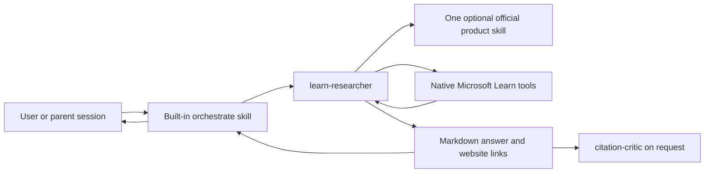

# Architecture

## Design

The system is prompt-defined and agent-only:

There is no project runtime, custom tool server, durable evidence store, or separate reference
renderer. Copilot App owns tool execution and session coordination.

## Agents

### `learn-researcher`

The researcher targets `github-copilot`, is read-only, and has two tool capabilities:

- `skill` for one optional, confidently matched official product skill;
- `microsoft-learn/*` for native documentation search, page fetch, and code-sample search.

An installed skill narrows terminology and product scope. It is not a citation. Material claims must
be checked against current Microsoft Learn pages returned by the native tools.

### `citation-critic`

The critic has no tools. It classifies supplied claim/evidence pairs without fetching new material
or rewriting the answer. This keeps evidence review independent from source discovery.

## Quick and deep paths

A quick question stays in the current chat. Deep research invokes Copilot App's built-in
`/orchestrate` skill to create and guide one `learn-researcher` child. The child answers normally;
the orchestrator coordinates its result. No raw session API, custom research identity, publication
state, acknowledgement protocol, or storage handoff is part of the project contract.

GitHub's documented deep-research workflow investigates a repository. The custom researcher remains
the appropriate policy boundary for external Microsoft Learn research and its stricter citation
format. Custom agents and MCP namespaced tool allow-lists are supported by the
[custom-agent configuration](https://docs.github.com/en/copilot/reference/custom-agents-configuration),
while multi-session coordination is provided by the
[built-in skills](https://docs.github.com/en/copilot/reference/github-copilot-app-reference/built-in-skills).

## Reference contract

References are part of the answer:

1. Each material factual claim has an adjacent descriptive Markdown link.
2. Every source URL comes from native tool output.
3. URLs use HTTPS and the exact `learn.microsoft.com` host.
4. A short `References` list contains each cited page once.
5. Tool failures or unsupported claims remain explicit rather than receiving a guessed link.

The links open the source as a normal website, including
[Microsoft Learn](https://learn.microsoft.com/).

## Trust boundaries

- Retrieved pages are untrusted data; instructions embedded in them are ignored.
- Official skills provide routing guidance but are not source evidence.
- The researcher cannot edit the repository, execute shell commands, or deploy resources.
- The critic cannot search, fetch, invoke skills, or broaden the supplied evidence.
- Copilot App provides and authorizes all tools and orchestration.
