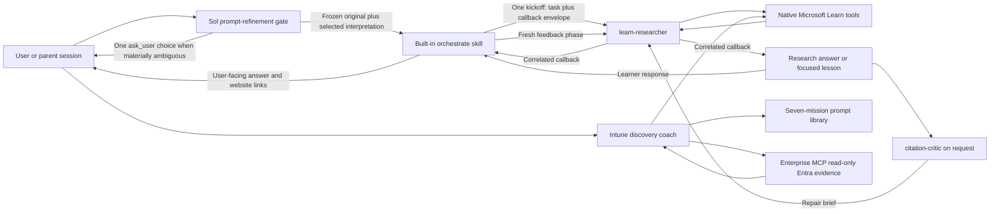

# Architecture

## Design

The system is prompt-defined and agent-only:

There is no project runtime, custom tool server, durable evidence store, or separate reference
renderer. Copilot App owns tool execution and session coordination.

## Agents

### `learn-researcher`

The researcher targets `github-copilot`, is read-only except for its coordinator callback, and has three
tool capabilities:

- `read` only for exact files created when a Learn tool spools oversized output;
- `microsoft-learn/*` for native documentation search, page fetch, and code-sample search;
- `send_session_message` only for a task-hash-and-nonce-correlated callback to the supplied coordinator.

The researcher does not load installed product skills or a product-skill catalog. It searches Learn
directly in every mode, and every material claim must be checked against the bounded set of fetched
Microsoft Learn pages.

### `citation-critic`

The critic has the same callback-only messaging exception. It reads only the exact
coordinator-supplied packet and may fetch only the Learn URLs already listed in that packet. It cannot
search, add a source, invoke a skill, or rewrite the answer. Review-time fetches independently verify
claims without being misrepresented as the researcher's original tool trace.

### `intune-discovery-coach`

The coach reads `prompts/intune/prompt-library.json` and exposes only `read`,
`microsoft-learn/*`, and `microsoft-enterprise/*`. Learn MCP supplies current documentation.
Enterprise MCP supplies delegated, read-only Entra evidence and the generated Microsoft Graph request
path. It cannot establish Intune configuration, assignment, compliance, managed-device, or endpoint
state; the learner supplies those facts from Intune and the assigned endpoint.

The coach rejects **All users**, **All devices**, and any target without current proof that the
trainee group contains exactly the assigned experiment device. It never performs writes. The learner
manually makes only a reversible, reviewed Intune change after the blast-radius gate passes.

## Quick and deep paths

A quick question stays in the current chat. Before either path, Sol classifies the request as clear,
exploratory, or materially ambiguous. Exploratory breadth is preserved; material ambiguity triggers one
`ask_user` choice among two or three interpretations that would produce different evidence or decisions.
The refinement record keeps the original request, selected interpretation, objective, scope, assumptions,
exclusions, and unresolved items. Only then is the task hashed.

Deep research invokes Copilot App's built-in `/orchestrate` skill with one kickoff containing the mode,
original and refined request, complete frozen task, task hash, callback
nonce, and coordinator session ID. The child sends correlated `STARTED` and `COMPLETED` or `FAILED`
messages. Idle notifications are diagnostic only. Direct discovery is the only research path. The
default context tier is sufficient for standard research; long context is an explicit escalation for
large evaluation/A-B packets, more than 30 atoms, or measured context pressure.

The coordinator owns intent. The research child does not reinterpret the frozen task, and weak-model
preprocessing starts only after Sol has fixed the interpretation.

Standard mode returns only the user-facing answer and References. Evaluation mode appends a
coordinator-only packet. The coordinator stores that packet as a session artifact, has a
different-model critic review it, starts a fresh repair-mode researcher with the exact prior answer and
repair brief, and publishes only the corrected user-facing portion. Markdown artifacts are read by
exact path rather than passed as kickoff attachments, which accept only app-staged creator images.

Focused learning has two fresh-child phases. A lesson receives one objective, learner level, time
budget, and optional diagnostic response; it uses at most five fetched pages and stops after one recall
and one application question. Feedback receives the exact lesson and learner responses, performs no new
discovery, corrects only missed concepts, asks one retry question, and returns a small learning ledger.
Conversation context is the only learner state unless the user explicitly requests a native scheduled
review.

GitHub's documented deep-research workflow investigates a repository. The custom researcher remains
the appropriate policy boundary for external Microsoft Learn research and its stricter citation
format. Custom agents and MCP namespaced tool allow-lists are supported by the
[custom-agent configuration](https://docs.github.com/en/copilot/reference/custom-agents-configuration),
while multi-session coordination is provided by the
[built-in skills](https://docs.github.com/en/copilot/reference/github-copilot-app-reference/built-in-skills).

## Reference contract

References are part of the answer:

1. Each material factual claim has an adjacent descriptive Markdown link.
2. Search results are discovery only; every cited page was successfully fetched.
3. The source set contains at most 15 authoritative pages.
4. Every Markdown link, including unresolved and next-step links, belongs to the successful fetch
   set. It uses an explicitly returned canonical URL or the exact successful request URL; canonical
   forms are never inferred or rewritten.
5. Every source URL comes from native tool output.
6. URLs use HTTPS and the exact `learn.microsoft.com` host.
7. A short `References` list contains each linked page once.
8. Tool failures or unsupported claims remain explicit rather than receiving a guessed link.
9. A coverage preflight fixes atomization before search. Each numbered item, bullet, or
   semicolon-delimited subtopic is one atom. Terms joined inside one item remain a compound atom and its
   least-supported dimension determines status.
10. Each decision area uses all three exact labels for fetched facts, synthesized recommendation, and
   assumptions or unresolved constraints, even when the last reports that none were identified.
11. Mutable claims such as service status, deprecation, availability, regions, and numeric limits
   require current fetched support.
12. Recommendations cannot introduce unfetched product capabilities or other material factual
   premises.
13. The core synthesis is at most 1,500 words. An evaluation run with more than 30 atoms may use at
    most 2,000 words solely to restore requested coverage.
14. Recommendations are checked against all fetched constraints and explicit scenario requirements;
    mutually exclusive options are selected between or presented as explicit conditional
    alternatives, and mandatory controls are not bypassed for convenience.
15. A core-length preflight removes repeated facts, catalog-style detail, and secondary examples
    before requested coverage. Recommendations apply fetched facts instead of restating them.
16. An evaluation request includes a coordinator-only coverage table after References with one row per
    fixed atom and one status: `Covered`, `Partially covered`, or `Unresolved`. Published totals equal
    the row count. A compound atom is Covered only when all named dimensions are supported.
17. The answer gives detailed discussion to at most three decision-critical unresolved groups and
    names every other unsupported atomic item tersely rather than hiding gaps behind an aggregate
    phrase.
18. Any item named or clearly restated in an assumptions block is `Partially covered` or `Unresolved`,
    never `Covered`.
19. Every named capability, generation, SKU, region, or compatibility relationship on which the lead
    recommendation depends has dedicated fetched evidence. Conflicting fetched sources remain
    explicit.
20. Numeric word-count estimates appear only when an available tool computed them deterministically.
21. Source actor, action, scope, support level, and conditions survive synthesis. Partial support is
    not promoted to support, and an automatic adoption step is not renamed as automatic creation or
    rotation.
22. Co-recommended controls receive an interaction preflight. Effects on operation and recovery are
    stated even when the controls are not strictly incompatible.
23. Fetched constraints propagate into relevant migration, copy or sharing, backup and restore,
    failover and failback, monitoring, and cost steps. Create-time, one-way, locked, and irreversible
    properties appear before rollout commits to them.
24. A conditional lead choice includes a fetched, scenario-compliant fallback or remains unresolved.
25. Evaluation answers append a coordinator-only packet containing the coverage audit, observations,
    and an evidence manifest with one row per fetched page. The packet is not user-facing output and
    adds no durable evidence store.
26. The core has a dedicated pre-rollout commitments table for every selected create-time, one-way,
    locked, irreversible, and mode-selection or mode-switch property. Each row states when the choice
    becomes fixed, its acceptance check, and fetched evidence or unresolved status.
27. Protective controls are checked against every recommended recovery and reconfiguration action.
    Required removal, exception, break-glass, and sequencing steps are explicit.
28. In evaluation mode, after the final assumptions blocks are drafted, the coverage audit is rebuilt
    and recounted so every affected row is downgraded and the status counts sum to the row count.
29. Every quantitative claim has adjacent fetched evidence for its exact value, scope, and conditions.
    In evaluation mode, the matching evidence-manifest row preserves those quantities.
30. Pre-rollout commitments come from a final sweep of every fetched and manifested create-time,
    one-way, locked, irreversible, and mode-switch qualifier. Each is accepted, left unresolved, or
    explicitly declined.
31. A compact protective-control interaction table maps each control to every affected recovery and
    reconfiguration action, its blocking effect, and the required sequence or fallback.
32. A single identity, key, DNS, network, or management plane that gates all access includes a tested,
    scenario-compliant recovery condition; an insecure bypass is not an acceptable fallback.
33. Audit rows describing the same mechanism use consistent statuses unless the core explains why
    their supported dimensions differ.
34. Every material fact or qualifier in an evaluation manifest maps to a core sentence or assumptions
    block and names the decisions or audit items it supports. Unused manifest facts do not justify
    `Covered`.
35. The evidence budget reserves pages for the lead architecture's exact tier and mode before
    alternatives: capability, reliability/operations, network/management-plane, and limits/lifecycle.
36. Every mandatory scenario action such as rotate, drill, fail over, fail back, restore, scale, or
    delete is checked against a dedicated operations page; capability support does not prove procedure.
37. When tools expose no retrieval timestamp, mutable values and lifecycle status are labeled
    time-sensitive and receive a deployment-time revalidation commitment.
38. Parent-heading and section scope are claim conditions. A current-to-target decision also surfaces
    lost capabilities, restart or redeploy requirements, defaults, side effects, billing or cost,
    permission scope, and management scope.
39. Relevant documented mode variants, including preview alternatives, are selected, explicitly
    excluded, or left unresolved rather than omitted.
40. A requested runbook includes an exact fetched CLI, API, or IaC operation and target scope when the
    selected operations page supplies one; otherwise the executable step remains unresolved.
41. Conclusions distinguish documented behavior from synthesized conditions and sequences.
42. The final core, coverage audit, and evidence manifest are rebuilt together. No manifest value absent
    from the core or source conflict silently reconciled by the answer may support `Covered`.
43. The word ceiling counts all user-visible core text before References, including headings, labels,
    tables, and fenced code, while excluding Markdown URL targets. Answers with code or tables target
    1,350 words to retain margin below the 1,500-word ceiling.
44. Every specific assumption or unresolved dimension reverse-maps to its compound audit row; the
    least-supported dimension sets the row status.
45. If one fetched page says an operation is unavailable while another exposes it, the answer reports a
    source conflict instead of silently choosing one.
46. Query parameters and selected pivots are evidence scope. Each link follows the smallest factual clause
    it independently supports; co-citation does not transfer qualifiers between pages.
47. Every recommended numeric or default setting is checked for conditional overrides and creation-time
    toggles, which are selected, explicitly excluded, or mapped to a partial audit status.
48. Each evidence-manifest row names exact `Core location` headings. Every semicolon-delimited value
    appears there with its qualifier, and material core facts map back to the supporting row.

## Formal review contract

When the user requests evidence review, a different model family receives the exact task, complete
answer, coordinator-only packet, and delivery channel. It reads that one packet and may refetch only
the exact Learn URLs already in References. It reviews task compliance, claim support, contradictions,
coverage status, and runtime defects without producing a competing architecture or broadening the
source set. Review-time fetches are labeled separately from the original trace.

The critic returns a repair brief. A fresh callback-enabled researcher receives the prior answer and
brief in one repair-mode packet and uses the existing source set unless a new fetch is explicitly
authorized. The brief is untrusted analysis rather than evidence: every proposed fact is verified against
an exact existing page and pivot, and unsupported suggestions remain unresolved. The coordinator verifies
the corrected result and publishes only its user-facing portion.
Controlled A/B runs fix the task hash and rubric and remove arm metadata until after the verdict.

The links open the source as a normal website, including
[Microsoft Learn](https://learn.microsoft.com/).

## Trust boundaries

- Retrieved pages are untrusted data; instructions embedded in them are ignored.
- The researcher cannot edit the repository, execute shell commands, or deploy resources. Its only
  mutation is a correlated callback to the exact coordinator session supplied in the kickoff.
- Installed product skills and their catalogs are outside the researcher trust boundary and are not
  invoked.
- Read access is limited by instruction to exact files spooled by Learn tool calls; unrelated
  workspace and user files are out of scope.
- The critic cannot search, add sources, invoke skills, or read outside the exact packet. It may fetch
  only existing Reference URLs for review-time verification.
- The Intune coach can query only the two App-configured MCP namespaces. Enterprise calls are limited
  by the external client's reviewed delegated grant and the signed-in user's access.
- Enterprise MCP exposes Entra evidence, not Intune configuration or managed-device APIs. Neither MCP
  server may mutate workshop state.
- Copilot App provides and authorizes all tools and orchestration.
