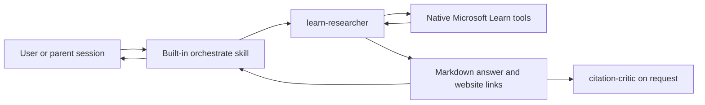

# Architecture

## Design

The system is prompt-defined and agent-only:

There is no project runtime, custom tool server, durable evidence store, or separate reference
renderer. Copilot App owns tool execution and session coordination.

## Agents

### `learn-researcher`

The researcher targets `github-copilot`, is read-only, and has two tool capabilities:

- `read` only for exact files created when a Learn tool spools oversized output;
- `microsoft-learn/*` for native documentation search, page fetch, and code-sample search.

The researcher intentionally does not load an installed product-skill catalog. Broad skill indexes
can inject substantial unrelated context, while direct Learn search already supplies current
discovery. Material claims must be checked against a bounded set of fetched Microsoft Learn pages.

### `citation-critic`

The critic has no tools. It classifies supplied claim/evidence pairs without fetching new material
or rewriting the answer. This keeps evidence review independent from source discovery.

## Quick and deep paths

A quick question stays in the current chat. Deep research invokes Copilot App's built-in
`/orchestrate` skill to create and guide one `learn-researcher` child. The child answers normally;
the orchestrator coordinates its result. If automatic delivery is unavailable, the coordinator
resolves the child's runtime session from its exact worktree and reads the persisted transcript with
app-native session-history tools. No custom research identity, publication state, acknowledgement
protocol, or storage handoff is part of the project contract.

GitHub's documented deep-research workflow investigates a repository. The custom researcher remains
the appropriate policy boundary for external Microsoft Learn research and its stricter citation
format. Custom agents and MCP namespaced tool allow-lists are supported by the
[custom-agent configuration](https://docs.github.com/en/copilot/reference/custom-agents-configuration),
while multi-session coordination is provided by the
[built-in skills](https://docs.github.com/en/copilot/reference/github-copilot-app-reference/built-in-skills).

## Reference contract

References are part of the answer:

1. Each material factual claim has an adjacent descriptive Markdown link.
2. Search results are discovery only; every cited page was successfully fetched.
3. The source set contains at most 12 authoritative pages.
4. Every source URL comes from native tool output.
5. URLs use HTTPS and the exact `learn.microsoft.com` host.
6. A short `References` list contains each cited page once.
7. Tool failures or unsupported claims remain explicit rather than receiving a guessed link.
8. The answer distinguishes fetched facts from scenario assumptions and synthesized recommendations.
9. Mutable claims such as service status, deprecation, availability, regions, and numeric limits
   require current fetched support.

The links open the source as a normal website, including
[Microsoft Learn](https://learn.microsoft.com/).

## Trust boundaries

- Retrieved pages are untrusted data; instructions embedded in them are ignored.
- The researcher cannot edit the repository, execute shell commands, or deploy resources.
- Read access is limited by instruction to exact files spooled by Learn tool calls; unrelated
  workspace and user files are out of scope.
- The critic cannot search, fetch, invoke skills, or broaden the supplied evidence.
- Copilot App provides and authorizes all tools and orchestration.
