# Public self-improvement loop

Status: proposed design

## Objective

Improve the quality and safety of Azure Learn Copilot answers without creating an autonomously
self-modifying system. Native Copilot App sessions may propose changes, but only maintainers can merge,
release, or roll them back. Every accepted change must be reproducible from public, sanitized evaluation
records.

This design extends the existing prompt-defined architecture. It does not add a runtime service, database,
extension, custom tool, canvas, or separate UI.

## Design principles

1. **Evidence before optimization.** A change must improve a frozen evaluation task and untouched holdouts,
   not merely appear better to its author.
2. **Fail closed.** Missing Learn evidence, invalid records, callback failure, privacy uncertainty, or a
   critical regression stops promotion.
3. **Human release authority.** Agents may research, criticize, repair, and evaluate. They cannot approve
   their own work or mutate production.
4. **Append-only provenance.** Published records are content-addressed. A correction supersedes a record;
   it never silently replaces one.
5. **Least data.** Public cases are synthetic or maintainer-sanitized. Raw conversations, personal data,
   secrets, and complete fetched page bodies are never committed.
6. **Reversible releases.** Each release identifies a prior known-good prompt bundle and a smoke suite that
   proves rollback behavior.
7. **Transparent limitations.** Releases publish regressions, unresolved decisions, evaluator limitations,
   and rejected proposals with their rationale when doing so is safe.

## System boundary

```mermaid
flowchart LR
    F[Voluntary issue or synthetic case] --> S[Maintainer sanitization]
    S --> D[Public evaluation dataset]
    D --> O[Native coordinator session]
    O --> R[learn-researcher baseline]
    R <--> L[Microsoft Learn]
    R --> E[Evaluation record]
    E --> C[Independent citation critic]
    C --> P[Fresh repair session]
    P --> G[Regression and holdout evaluation]
    G --> H[Human release gate]
    H -->|approve| V[Versioned prompt bundle]
    H -->|reject| X[Rejected change record]
    V --> B[Opt-in canary or shadow corpus]
    B -->|pass| Q[Release tag]
    B -->|fail| K[Rollback to known-good tag]
```



Copilot App remains the execution and coordination plane. Git stores public contracts, sanitized fixtures,
results, approvals, and release metadata. Session artifacts hold transient traces and exact review packets.
Microsoft Learn remains the factual source for answers.

## Loop and state machine

```text
PROPOSED -> SANITIZED -> FROZEN -> BASELINED -> EVALUATED
    -> DIAGNOSED -> REPAIRED -> REEVALUATED -> APPROVED
    -> CANARY -> RELEASED
```

Any stage may terminate as `REJECTED` or `QUARANTINED`; a released version may become `ROLLED_BACK`.

| Transition | Owner | Required evidence |
| --- | --- | --- |
| Proposed to sanitized | Maintainer | Privacy checklist, minimal reproduction, contribution consent |
| Sanitized to frozen | Coordinator | Task hash, fixed atoms, rubric version, assumptions, exclusions |
| Frozen to evaluated | Researcher and evaluator | Baseline answer, fetched-reference manifest, per-atom verdicts |
| Evaluated to diagnosed | Independent critic | Exact blind packet, fixed source set, severity-ranked findings |
| Diagnosed to repaired | Fresh researcher | Prior answer, critic brief, candidate prompt or contract diff |
| Repaired to reevaluated | Evaluator | Failing cases plus untouched holdouts and adversarial cases |
| Reevaluated to approved | Independent maintainer | All hard gates pass, disclosed tradeoffs, signed review |
| Approved to canary | Release maintainer | Versioned bundle, release notes, known-good rollback target |
| Canary to released | Release maintainer | Predeclared canary gates pass; otherwise rollback |

A model judgment is evidence for review, never release authority. The critic must use a different model
family, receive a blinded packet, and verify only the packet's existing Learn URLs. The repair session is
fresh so it cannot rely on the original researcher's hidden context.

## Public record contract

Records use canonical UTF-8 JSON: object keys sorted lexicographically, no insignificant whitespace, arrays
kept in schema-defined semantic order, and SHA-256 calculated over the canonical bytes. Every record has
`schemaVersion`, `id`, `createdAt`, `producer`, and optional `supersedes`. Git history is tamper-evident, not
an absolute immutable ledger.

| Record | Required content |
| --- | --- |
| `TaskRecord` | Sanitized request, selected interpretation, fixed atoms, assumptions, exclusions, unresolved items, rubric ID, task hash |
| `AnswerRecord` | Task ID, prompt-bundle commit, agent and model IDs, answer hash, references, run status |
| `EvidenceRecord` | Answer ID, exact fetched URL, fetch status, retrieval time when available, content hash, claim IDs, actor/action/scope/qualifiers; never the page body |
| `EvaluationRecord` | Answer and rubric IDs, evaluator ID, blind arm, per-atom verdicts, severity, metrics with denominators, cost units, input/output hashes |
| `ChangeRecord` | Diagnosis, candidate commit or pull request, linked evaluations, approvals, release tag, prior known-good tag, rejection or rollback reason |

Suggested repository layout for implementation:

```text
evaluation/
  schemas/
  fixtures/public/
  fixtures/holdout-manifest.json
  rubrics/
  runs/
docs/
  improvement-loop.md
  privacy.md
  release-runbook.md
```

The holdout manifest is public; the holdout cases remain maintainer-restricted until rotation to reduce
benchmark gaming. Public run records may identify holdout case IDs and aggregate slice results without
revealing case content.

## Evaluation model

Microsoft describes pre-production datasets and sampled post-production monitoring as complementary
stages of [AI observability](https://learn.microsoft.com/azure/foundry/concepts/observability). For this
repository, those concepts define the measurement vocabulary; they do not create a Foundry dependency.

### Offline suites

Use synthetic Azure questions stratified by product, task type, ambiguity, required operation, mutable
fact, and safety risk. Include ordinary cases, prior regressions, prompt injection in retrieved content,
callback failures, unsupported negative claims, qualifier loss, and privacy leakage.

Publish each metric as a numerator and denominator:

- contract pass rate;
- fetched cited URLs / cited URLs;
- supported material claims / reviewed material claims;
- fully supported atoms / frozen atoms;
- responses with a critical defect / evaluated responses;
- repaired cases passing both regression and holdout suites / attempted repairs;
- human and critic disagreements / reviewed verdicts;
- callback and tool failures / attempted runs;
- latency and available token or cost units / accepted improvement.

Groundedness measures whether an answer adds unsupported content, while response completeness checks whether
the expected content was covered. Microsoft documents these as precision- and recall-oriented concepts in
the [RAG evaluator guidance](https://learn.microsoft.com/azure/foundry/concepts/evaluation-evaluators/rag-evaluators).
Agent evaluation also separates final outcome from process and tool behavior, although several documented
evaluators are preview and are not a production dependency here
[in the agent evaluator guidance](https://learn.microsoft.com/azure/foundry/concepts/evaluation-evaluators/agent-evaluators).

Record and citation integrity must be complete, and no critical evidence, safety, or privacy defect may
remain. Other thresholds are versioned in the rubric before a run; they are never selected after results
are visible.

### Anti-gaming controls

- Freeze the task hash, rubric, model configuration, and thresholds before execution.
- Blind candidate and baseline labels until the critical-defect verdict is complete.
- Keep immutable holdouts and rotate leaked cases into the public regression corpus.
- Report every slice; an aggregate gain cannot hide a safety or product regression.
- Prevent candidate authors from writing expected answers or approving their own changes.
- Audit a sample manually and publish human-critic disagreement.
- Bound sources, retries, cases, and concurrent sessions; a budget failure is a failed run, not missing data.

### Online signals

The first public version accepts voluntary categorized reports only. A maintainer converts an accepted
report into a sanitized reproduction before it enters the dataset. There is no passive transcript capture.
Sampled production evaluation remains disabled until public hosting, consent, retention, traffic, and
budget policies are approved.

## Release and rollback

A candidate can be approved only when:

1. Existing contract tests and schema validation pass.
2. Task, answer, evidence, evaluation, and change records link without gaps.
3. All cited URLs were fetched and every material claim has a verdict.
4. No critical safety, privacy, evidence, or callback defect remains.
5. Frozen aggregate and per-slice thresholds pass on regression and holdout suites.
6. An independent maintainer approves the pull request.
7. Release notes identify changed prompts, metrics, regressions, known limitations, and the rollback tag.

Until a hosted traffic path exists, a canary is an opt-in branch or shadow corpus. A rollback restores the
prior known-good prompt bundle, reruns the smoke corpus, and publishes a `ChangeRecord`; it never bypasses
branch protection or deletes the failed release history.

## Threat model and controls

| Threat | Control |
| --- | --- |
| Prompt injection in user or Learn content | Treat retrieved text as data, keep agents read-only, test direct and indirect injection cases |
| Poisoned fixtures or rubric manipulation | Review provenance, freeze hashes, require independent approval, quarantine malformed records |
| Holdout leakage or evaluator gaming | Restrict holdout content, blind arms, rotate leaks, publish slice results |
| Evaluator collusion or nondeterminism | Different model family, repeated deterministic contract checks, human audit, no model-only release |
| Sensitive-data publication | Maintainer sanitization, forbidden-field schema tests, secret scanning, no raw transcript retention |
| Contributor supply-chain change | Protected branches, code ownership, least privilege, contributor cannot self-approve |
| Retry and cost exhaustion | Fixed source, retry, batch, and session limits; stop on budget breach |
| Unsafe automated mutation | No write-capable research agent, no deployment credentials, human gate for every release |

Microsoft recommends version control and continuous testing for safety prompts, plus human review for
critical AI actions, in the
[Microsoft Cloud Security Benchmark AI guidance](https://learn.microsoft.com/security/benchmark/azure/mcsb-v2-artificial-intelligence-security).
Risk tests should include harmful content, protected material, vulnerable code, indirect attack, and
sensitive-data leakage where applicable
[as categorized by Foundry](https://learn.microsoft.com/azure/foundry/concepts/evaluation-evaluators/risk-safety-evaluators).
Automated red teaming uses synthetic inputs and nondeterministic judges, so findings still require human
review; the current Foundry agentic path also does not support non-Foundry agents
[under its documented limitations](https://learn.microsoft.com/azure/foundry/concepts/ai-red-teaming-agent).

## Public governance

Roles are explicit:

- **Contributor:** reports a failure or proposes a fixture or candidate change.
- **Maintainer:** sanitizes reports, freezes tasks, owns rubrics, and operates releases.
- **Independent reviewer:** did not author the candidate and approves or rejects it.
- **Security/privacy reviewer:** required for sensitive-data, safety, or retention changes.

Contribution flow:

```text
issue or pull request -> privacy and consent check -> sanitized failing fixture
-> baseline -> candidate -> blind evaluation -> independent review -> merge or documented rejection
```

Publish schemas, rubrics, public fixtures, aggregate holdout results, decisions, prompt changes, releases,
rollbacks, and known gaps. Responsible AI guidance emphasizes lifecycle policy, source transparency,
feedback privacy, auditability, human intervention, and governance sign-off
[for AI workloads](https://learn.microsoft.com/azure/well-architected/ai/responsible-ai).

## Delivery phases

| Phase | Deliverable | Acceptance |
| --- | --- | --- |
| 1. Contract | JSON schemas, valid/invalid fixtures, canonical hash utility, privacy rules | Tests reject bad transitions, broken references, unstable hashes, and forbidden fields |
| 2. Corpus | Synthetic public regressions, restricted holdout manifest, versioned rubric | Repeated runs preserve task hash, atom count, rubric version, and metric denominators |
| 3. Critic and repair | Record IDs in agent contracts, blind packet, reevaluation flow | A seeded defect is found, repaired, and passes its regression plus untouched holdouts |
| 4. Release governance | Pull request templates, ownership, changelog, release and rollback runbooks | Dry runs demonstrate rejection, approval, release, and rollback |
| 5. Conditional pilot | Opt-in canary and sampled monitoring | Blocked until hosting, privacy, retention, traffic, and budget decisions are approved |

## Decisions required before implementation

- Open-source license and contributor agreement or developer certificate of origin.
- Required approver count, signing policy, and ownership rotation.
- Feedback retention period and deletion process.
- Holdout access, disclosure, and rotation policy.
- Evaluation budget owner and hard run limits.
- Canary duration, traffic percentage if hosted, and incident response target.
- Public hosting and telemetry consent model.

Phases 1 through 4 require no new runtime service. Phase 5 is intentionally blocked until these operating
decisions are recorded.

## References

- [Responsible AI in Azure workloads](https://learn.microsoft.com/azure/well-architected/ai/responsible-ai)
- [Artificial Intelligence Security](https://learn.microsoft.com/security/benchmark/azure/mcsb-v2-artificial-intelligence-security)
- [Observability in generative AI](https://learn.microsoft.com/azure/foundry/concepts/observability)
- [RAG evaluators](https://learn.microsoft.com/azure/foundry/concepts/evaluation-evaluators/rag-evaluators)
- [Agent evaluators](https://learn.microsoft.com/azure/foundry/concepts/evaluation-evaluators/agent-evaluators)
- [Risk and safety evaluators](https://learn.microsoft.com/azure/foundry/concepts/evaluation-evaluators/risk-safety-evaluators)
- [AI Red Teaming Agent](https://learn.microsoft.com/azure/foundry/concepts/ai-red-teaming-agent)
